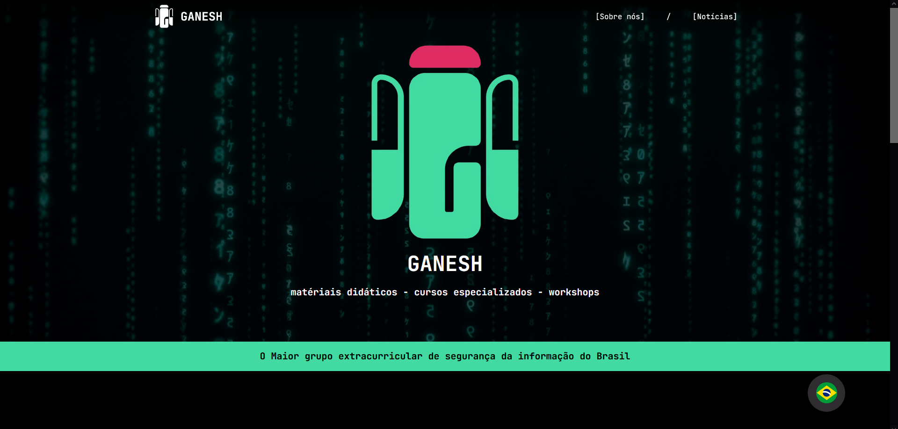
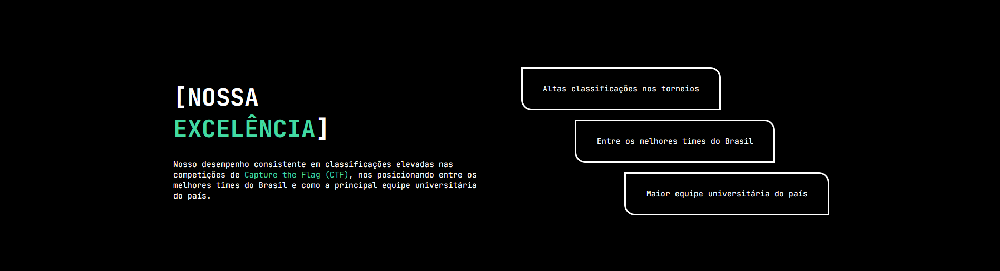
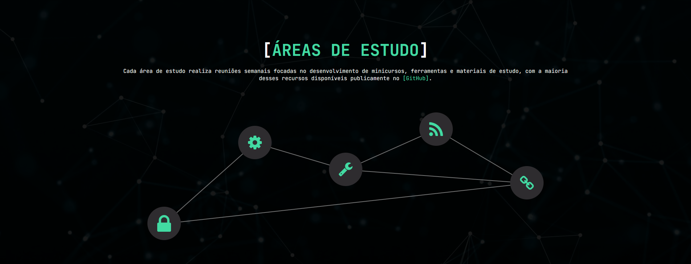
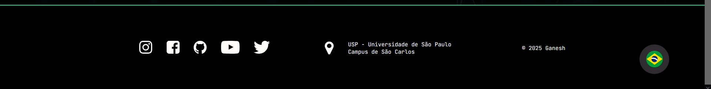

# USP-Codelabs-Dev.Learn
Projeto desenvolvido para participar do processo seletivo do grupo de extensão Codelabs. O projeto consiste em uma aplicação web para outro grupo de extensão do ICMC, o Ganesh. 

# Objetivos principais:
- Landing Page: Informações essenciais do Ganesh;
- Página de noticias: com paginação;
- Opções de idioma das páginas: Português / Inglês.

# Links importantes para o desenvolvimento
- Instruções no Notion: https://uspcodelabsanca.notion.site/Projeto-dos-Experientes-1c08def36c16818d8299e0a3ca3cfcc2#1c08def36c1681639ce7c82d99dad60c
- Link do Figma (feito pelos membros do Codelabs): https://www.figma.com/design/Ap0jkN7FBAX5MYpsd8Sjg2/Dev-Learn---2025.1?node-id=0-1&t=JvDrQ3apYJCYI5MD-1
- Imagens no drive: https://drive.google.com/drive/folders/1tv8scUCR-nEjspHWXPLbbejAeJRSYR0S?usp=sharing

# Cronograma (12/05 - 15/06)
- Prototipação (12/05 - 15/05): https://13q3ms.axshare.com/?g=4
- Code da parte estática (17/05)
- Code da parte dinâmica (14/06)

# Mini Servidor para Rodar o JSON!

## Instalação do Servidor Local (`http-server`)

No terminal, execute o seguinte comando para instalar o servidor de forma global:
npm install -g http-server

## Como Iniciar o Servidor
http-server
⚠️ Importante: Sempre que abrir ou recarregar as páginas no navegador, utilize: Ctrl + F5

## Links das Páginas
- Página Inicial: http://192.168.0.120:8080/landing-page.html
- Página de Notícias: http://192.168.0.120:8080/noticias.html

# Imagens do projeto:

